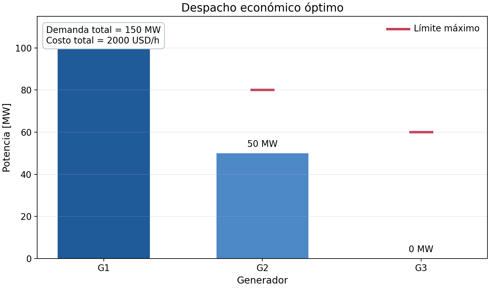

# Despacho económico uninodal en Julia

[](https://julialang.org/)
[](LICENSE)
[](https://github.com/USUARIO/despacho-economico-julia/actions/workflows/ci.yml)

Ejemplo reproducible de un despacho económico de una hora para un sistema
uninodal con tres generadores térmicos y una carga. El modelo se implementa en
Julia con JuMP y se resuelve con HiGHS.

> Antes de publicar: sustituya `USUARIO`, `NOMBRE DEL AUTOR`, los datos de
> `CITATION.cff` y los DOI provisionales por la información real del proyecto.

## Contenido

- [Objetivo](#objetivo)
- [Modelo matemático](#modelo-matemático)
- [Datos del caso](#datos-del-caso)
- [Resultado esperado](#resultado-esperado)
- [Estructura del repositorio](#estructura-del-repositorio)
- [Instalación](#instalación)
- [Ejecución con CSV](#ejecución-con-csv)
- [Ejecución con MAT](#ejecución-con-mat)
- [Uso en Jupyter](#uso-en-jupyter)
- [Archivos de salida](#archivos-de-salida)
- [Pruebas](#pruebas)
- [Reproducibilidad](#reproducibilidad)
- [Datos y resultados en Zenodo](#datos-y-resultados-en-zenodo)
- [Citación](#citación)
- [Licencias](#licencias)
- [Contribuciones](#contribuciones)

## Objetivo

Determinar la potencia generada por cada unidad para satisfacer una demanda de
150 MW con el menor costo variable posible. El ejemplo no considera pérdidas,
límites de líneas, rampas, reservas ni variables binarias.

## Modelo matemático

La variable \(P_g\) representa la potencia del generador \(g\), en MW. Para un
intervalo de duración \(\Delta t\), el problema es:

$$
\min_{P_g}\; C = \Delta t\sum_{g\in\mathcal{G}} c_g P_g
$$

sujeto al balance de potencia:

$$
\sum_{g\in\mathcal{G}} P_g = P_D,
$$

y a los límites de cada generador:

$$
P_g^{\min}\leq P_g\leq P_g^{\max},\qquad g\in\mathcal{G}.
$$

Como no se incluyen pérdidas, la generación total debe ser exactamente igual a
la demanda.

## Datos del caso

| Generador | \(P_g^{\min}\) [MW] | \(P_g^{\max}\) [MW] | Costo [USD/MWh] |
|---|---:|---:|---:|
| G1 | 20 | 100 | 10 |
| G2 | 10 | 80 | 20 |
| G3 | 0 | 60 | 35 |

Demanda: 150 MW. Duración: 1 h.

Comprobación de factibilidad:

$$
\sum_g P_g^{\min}=30\ \text{MW}\leq150\ \text{MW}
\leq240\ \text{MW}=\sum_g P_g^{\max}.
$$

## Resultado esperado

El generador más económico, G1, alcanza 100 MW. Los 50 MW restantes son
proporcionados por G2. G3 no se utiliza porque tiene el mayor costo.

| Generador | Despacho [MW] | Costo del intervalo [USD] |
|---|---:|---:|
| G1 | 100 | 1000 |
| G2 | 50 | 1000 |
| G3 | 0 | 0 |
| **Total** | **150** | **2000** |



## Estructura del repositorio

```text
despacho-economico-julia/
|-- .github/workflows/ci.yml
|-- data/
|   |-- input/generators.csv
|   |-- input/load.csv
|   `-- mat/dispatch_input.mat
|-- docs/
|   |-- images/dispatch_example.png
|   `-- wiki_templates/
|-- notebooks/DespachoEconomico.ipynb
|-- paper/main.tex
|-- results/
|-- scripts/create_mat_inputs.jl
|-- scripts/run_dispatch.jl
|-- src/DespachoEconomico.jl
|-- test/runtests.jl
|-- CHANGELOG.md
|-- CITATION.cff
|-- CONTRIBUTING.md
|-- LICENSE
|-- LICENSE-DATA.md
|-- Project.toml
`-- README.md
```

## Instalación

### Requisitos

- Julia 1.10 o posterior.
- Git.
- Jupyter Notebook o JupyterLab, solo si se usará el notebook.

### Descargar el proyecto

```bash
git clone https://github.com/USUARIO/despacho-economico-julia.git
cd despacho-economico-julia
```

### Instalar las dependencias

```bash
julia --project=. -e 'using Pkg; Pkg.instantiate()'
```

Este comando lee `Project.toml` y `Manifest.toml` cuando está disponible.

## Ejecución con CSV

Desde la raíz del repositorio:

```bash
julia --project=. scripts/run_dispatch.jl csv
```

Los datos se leen de:

- `data/input/generators.csv`
- `data/input/load.csv`

## Ejecución con MAT

Para generar el archivo MAT a partir de los CSV:

```bash
julia --project=. scripts/create_mat_inputs.jl
```

Después ejecute:

```bash
julia --project=. scripts/run_dispatch.jl mat
```

El archivo `data/mat/dispatch_input.mat` contiene:

- `generator_data`: matriz con columnas Pmin, Pmax y costo;
- `demand_mw`: demanda del sistema;
- `duration_h`: duración del intervalo.

## Uso en Jupyter

Instale IJulia una sola vez desde Julia:

```julia
using Pkg
Pkg.add("IJulia")
```

Abra JupyterLab desde Anaconda Navigator y cargue
`notebooks/DespachoEconomico.ipynb`. También puede iniciar JupyterLab desde
Julia:

```julia
using IJulia
jupyterlab()
```

## Archivos de salida

Cada ejecución actualiza:

- `results/dispatch_results.csv`: despacho por generador;
- `results/summary.csv`: demanda, generación, residuo y costo;
- `results/dispatch_results.mat`: resultados para MATLAB;
- `results/dispatch.png`: gráfica del despacho.

El residuo de balance debe ser numéricamente cercano a cero.

## Pruebas

Ejecute:

```bash
julia --project=. test/runtests.jl
```

La prueba comprueba el estado óptimo, el despacho `[100, 50, 0]` MW, el balance
de 150 MW y el costo de 2000 USD. GitHub Actions repite esta prueba después de
cada `push` y de cada `pull request` hacia `main`.

## Reproducibilidad

1. Use la versión de Julia indicada en `Project.toml`.
2. Ejecute `Pkg.instantiate()` antes del modelo.
3. No cambie los archivos de entrada si desea reproducir este caso.
4. Registre cualquier cambio de datos o supuestos en `CHANGELOG.md`.
5. Publique una nueva versión cuando los archivos o resultados cambien.

## Datos y resultados en Zenodo

El release estable del código se archivará automáticamente mediante la
integración GitHub-Zenodo. Los datos y resultados extensos se publicarán como un
registro independiente de tipo *Dataset* y se relacionarán con el DOI del
software.

- DOI del software: https://doi.org/10.5281/zenodo.22286302
- DOI de los datos y resultados: https://doi.org/10.5281/zenodo.22286302

## Citación

GitHub mostrará la opción **Cite this repository** a partir de `CITATION.cff`.
Después del primer depósito en Zenodo, añada el DOI real a `CITATION.cff` y a
esta sección.

## Licencias

- Código: MIT, consulte [LICENSE](LICENSE).
- Datos sintéticos del ejemplo: CC0 1.0, consulte
  [LICENSE-DATA.md](LICENSE-DATA.md).

Estas licencias no deben aplicarse automáticamente a datos reales. Antes de
publicarlos, confirme propiedad, permisos, confidencialidad y condiciones de
redistribución.

## Contribuciones

Las correcciones y ampliaciones se gestionan mediante *issues*, ramas y *pull
requests*. Consulte [CONTRIBUTING.md](CONTRIBUTING.md).

## Contacto

**NOMBRE DEL RESPONSABLE**  
Institución: **INSTITUCIÓN**  
Correo: **CORREO INSTITUCIONAL**
